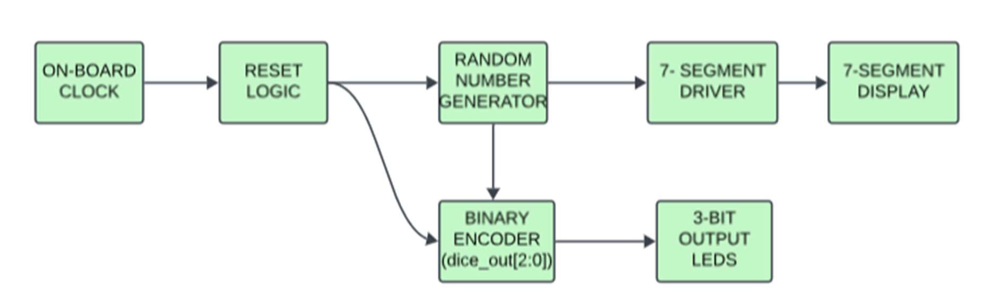
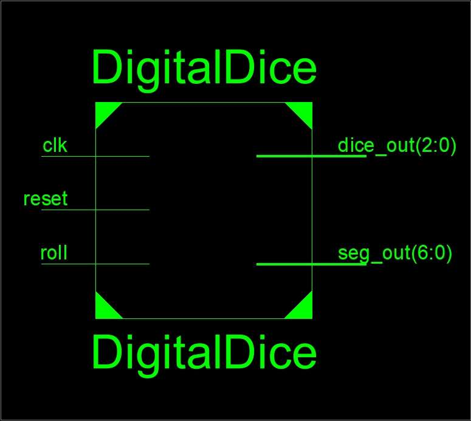
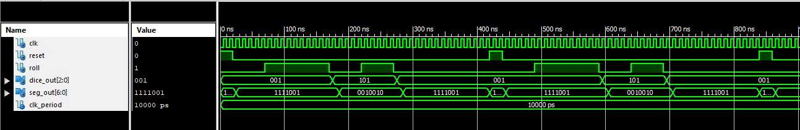
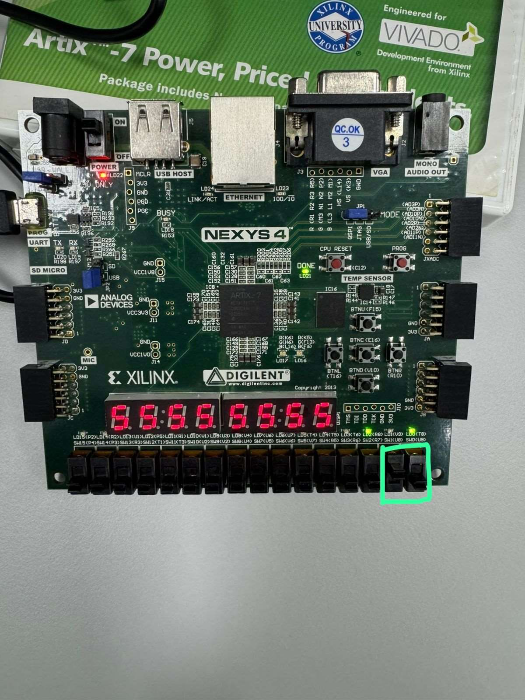
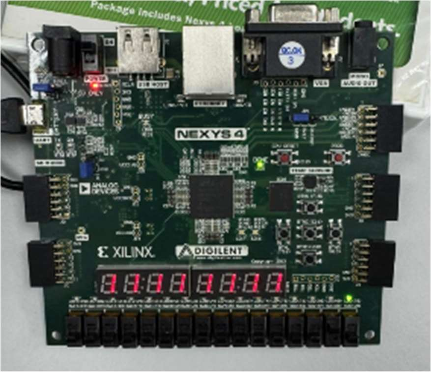
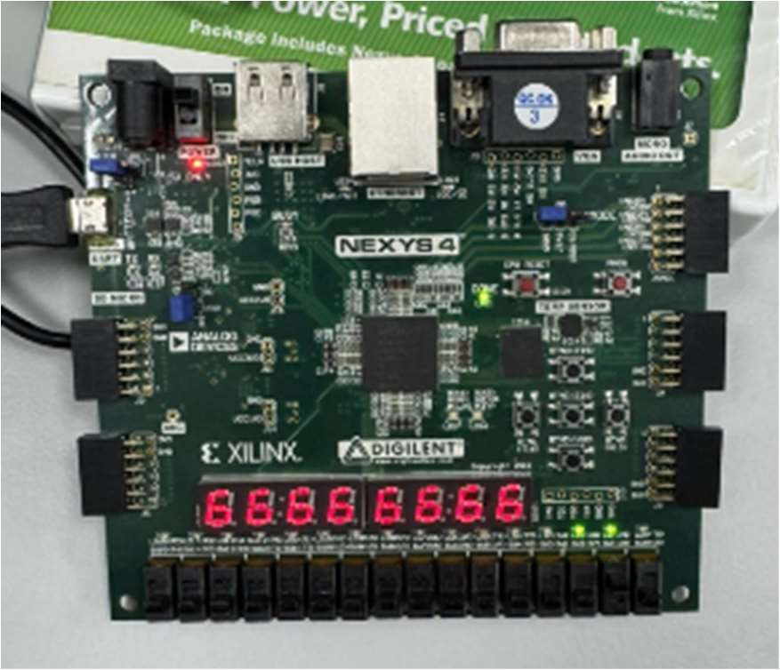
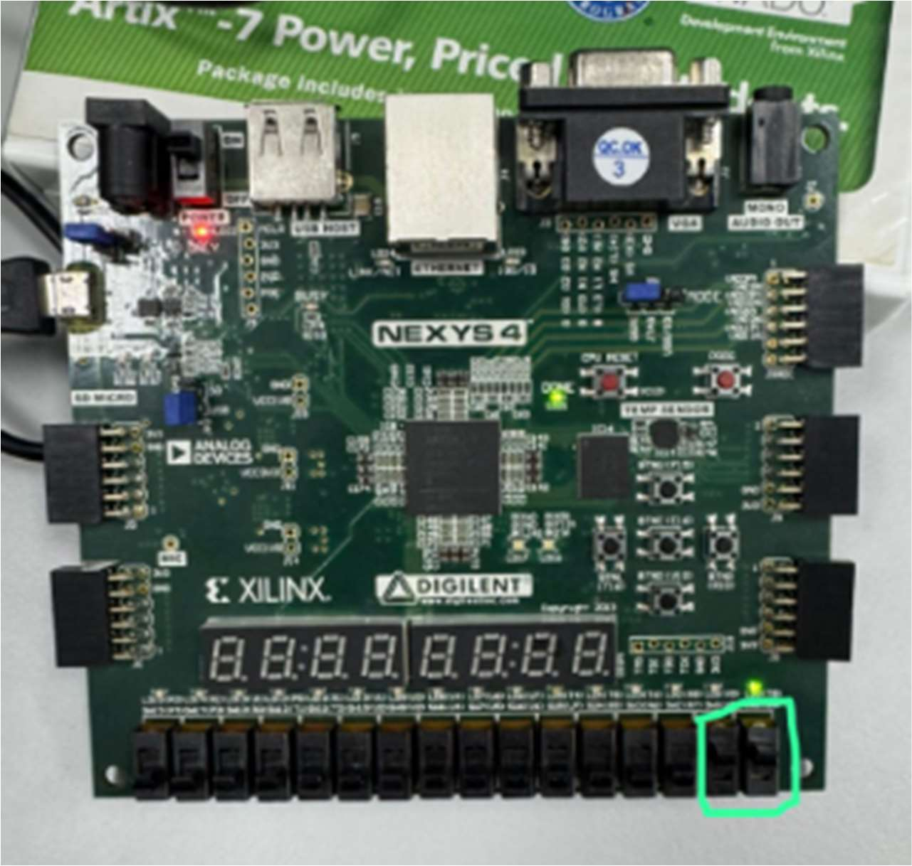

# Digital Dice — FPGA/VHDL Project

> **COE321: Digital Systems Design**  
> Ajman University — College of Engineering and Information Technology  
> Department of Electrical and Computer Engineering

A digital implementation of a standard 6-sided die, designed in VHDL and deployed on a **Nexys 4 FPGA board**. The system uses a **3-bit Linear Feedback Shift Register (LFSR)** to generate pseudo-random numbers (1–6), displaying the result on a 7-segment display and via 3 binary LEDs.

---

## Block Diagram



---

## RTL Diagram



---

## Simulation Results



The simulation confirms:
- Output only updates when the roll button transitions from HIGH to LOW
- Reset overrides all other inputs
- Binary LED output and 7-segment display stay in sync at all times

---

## Hardware Demo

**Board overview — dice running on the Nexys 4:**



**Roll active — segment displays the current dice value:**



**Different output values — observe the LEDs for binary representation:**



**Reset active — roll input is ignored, display blanks:**



---

## Features

- Pseudo-random number generation using a 3-bit LFSR
- Output displayed on a 7-segment display (values 1–6)
- Binary output shown on the first 3 LEDs of the board
- Active-high Roll and Reset button controls
- Fully synchronous design with clock-driven state transitions

---

## Inputs & Outputs

| Signal | Direction | Width | Description |
|---|---|---|---|
| `clk` | Input | 1-bit | Board clock — triggers all transitions |
| `reset` | Input | 1-bit | Active-high reset; clears all state |
| `roll` | Input | 1-bit | Hold high to roll; release to capture result |
| `dice_out` | Output | 3-bit | Dice value in binary on LEDs 0–2 |
| `seg_out` | Output | 7-bit | 7-segment display encoding of result |

---

## 7-Segment Encoding

| Dice Value | `seg_out` |
|---|---|
| 1 | `1111001` |
| 2 | `0100100` |
| 3 | `0110000` |
| 4 | `0011001` |
| 5 | `0010010` |
| 6 | `0000010` |
| Reset/Blank | `1111111` |

---

## How It Works

1. **Roll button held HIGH** → LFSR begins shifting, cycling through pseudo-random 3-bit values each clock cycle
2. **Roll button released (LOW)** → The current LFSR value is captured and mapped to a valid dice range (1–6). Values `000` and `111` are remapped to `1`
3. **Reset button HIGH** → LFSR resets to `001`, dice value resets to `1`, display blanks

**LFSR Feedback Polynomial:**
```
lfsr <= lfsr(1 downto 0) & (lfsr(2) xor lfsr(1));
```

---

## Files

```
DigitalDice/
├── DigitalDice.vhd              # Main design file
├── DigitalDiceTestBench.vhd     # Simulation test bench
├── README.md                    # This file
└── images/
    ├── block_diagram.png
    ├── rtl_diagram.png
    ├── simulation_results.png
    ├── fpga_board_overview.png
    ├── fpga_roll_active.png
    ├── fpga_different_values.png
    └── fpga_reset_active.png
```

---

## Tools & Hardware

- **IDE:** Xilinx Vivado / ISE Design Suite
- **Board:** Nexys 4 (Artix-7 FPGA)
- **Language:** VHDL

---

## How to Run

1. Open Xilinx Vivado and create a new project
2. Add `DigitalDice.vhd` as the design source
3. Add `DigitalDiceTestBench.vhd` as the simulation source
4. Run **Behavioral Simulation** to verify outputs
5. Add your Nexys 4 constraints file (`.xdc`) and map the ports to the appropriate pins
6. Run **Synthesis → Implementation → Generate Bitstream**
7. Program the FPGA board
